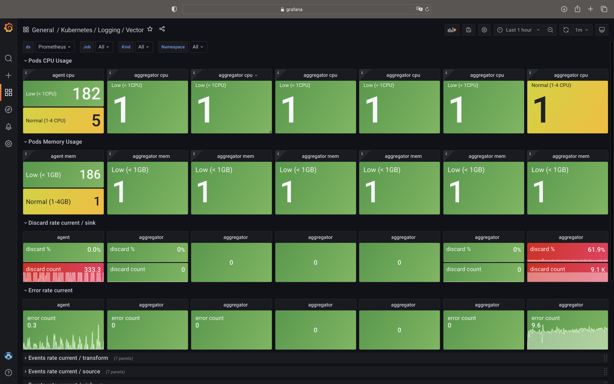
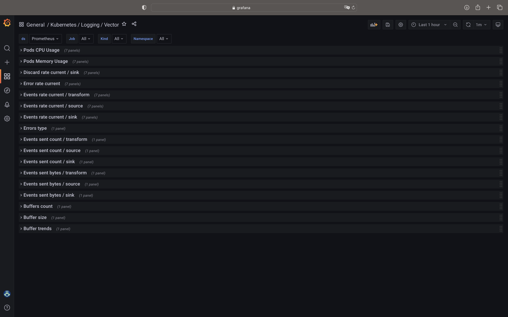

# Kubernetes Vector Grafana Dashboard

This dashboard was developed with Kubernetes logging in mind.

## Available panels with metrics

- Pods CPU Usage
- Pods Memory Usage
- Discard rate current / sink
- Error rate current
- Events rate current / transform
- Events rate current / source
- Events rate current / sink
- Errors type
- Events sent count / transform
- Events sent count / source
- Events sent count / sink
- Events sent bytes / transform
- Events sent bytes / source
- Events sent bytes / sink
- Buffers count
- Buffer size
- Buffer trends

## Import dashboard to Grafana

1. Download the dashboard from `dashboards/k8s-vector-grafana-dashboard.json` or [Grafana Dashboard Page](https://grafana.com/grafana/dashboards/19514-kubernetes-logging-vector/)
2. Follow the instructions from the official [Grafana's manual](https://grafana.com/docs/grafana/latest/dashboards/manage-dashboards/#import-a-dashboard)

## Contribution

Feel free to ask for help or contribute.
